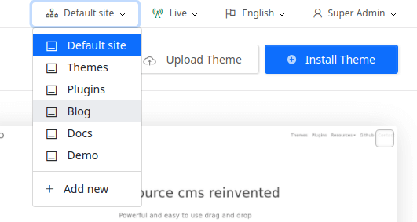

# First steps after installation

## Choose your theme

## Install your plugins

## Multi site (optional)
Vvveb supports multi site, if you have a multi site setup then the first step is to add your sites from admin > settings > site
When you editing content or making changes make sure to select the desired site from the top bar 

If you only have one website then skip this step *Default Site* will be automatically selected.
 

## Multi language (optional)

## Ecommerce
