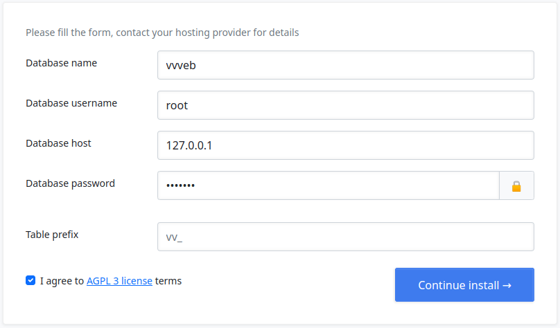
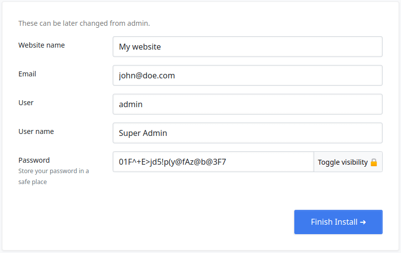

# Installing Vvveb on your website

To install Vvveb download the zip from [vvveb.com](http://vvveb.com/download.php)

* Unpack the zip and upload the contents to your server, you can use FTP or Cpanel
* Create a new database in Mysql (MariaDb) you can do this from PhpMyadmin or from your hosting Cpanel admin
* Configure [apache](/apache) or [nginx](/nginx) webserver.
* Open the address of your website (eg: [localhost](http://localhost)) and the installation wizard will show 

## Step 1 - Database configuration

Enter database details created on previous step 

## Step 2 - User and Site Information

Enter your email and password that you will use to login to your website. 

## How to install with xampp

